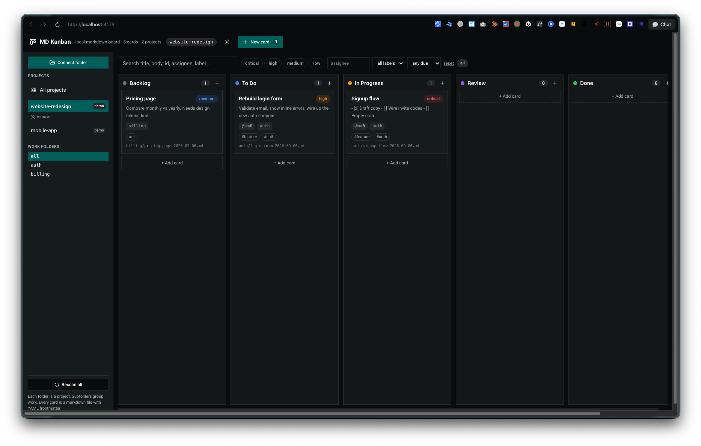

# MD Kanban

A project kanban that lets you track what your AI agents are doing. Each project is a folder, each task is a markdown file, and your agents read and write those files directly. You watch the board and always know what is done and what is not. Built as a Vue 3 + Vite + shadcn-vue web app that runs fully local after `npm run build`.



## How it works

- **Each folder you connect is a project.** Use "Connect folder" in the sidebar (Chrome or Edge, via the File System Access API). You can connect multiple folders.
- **Subfolders group work.** `my-project/auth/login.md` shows as project `my-project`, work folder `auth`.
- **Each card is a markdown file.** Drag a card to another column and the file's `status` updates. Edit a card and the file saves. Create or delete cards to create or delete files.
- **AI agents can read and write the same files.** Point your agent at the project folder and `AGENTS.md`. No accounts, no server, works offline.

## File format

Every card is a markdown file with YAML frontmatter. Files live anywhere inside the project folder:

```markdown
---
id: "login-form-2026-09-06"
status: "todo"
priority: "high"
assignee: "safi"
dueDate: "2026-09-10"
created: "2026-09-06T10:30:00.000Z"
modified: "2026-09-06T14:20:00.000Z"
labels: ["feature", "auth"]
order: 1
---

# Rebuild login form

Describe the work here. Checkboxes, notes, links all welcome.
```

`status` is one of `backlog`, `todo`, `in-progress`, `review`, `done`. `priority` is `critical`, `high`, `medium`, `low`.

## Desktop app

There is also an Electron app you can install locally instead of using the browser:

```bash
npm run dist
```

This builds `release/MD Kanban-0.0.0-arm64.dmg`. Open it, drag to Applications, and launch. Tested on macOS. Not tested on Linux or Windows yet.

The app is unsigned, so macOS shows a warning on first launch. Right click the app, choose Open, then confirm. `npm run electron:dev` runs the desktop shell in development.

## Run it in the browser

```bash
npm install
npm run dev      # local dev
npm run build    # static output in dist/, open it with any static server
npm run preview  # preview the production build
```

Serve `dist/` locally, e.g. `npx serve dist`, then open the URL and connect your project folders. Folder handles persist in IndexedDB, so projects survive reloads. Browsers without the File System Access API (Firefox, Safari) get built-in demo projects; use Chrome or Edge for real folders.

## Keyboard

- `N` new card, `Esc` close dialogs, drag cards between columns.

## Later

Online hosting and sync come after the local version proves itself. The file format stays the same, so today's markdown folders migrate as-is.
